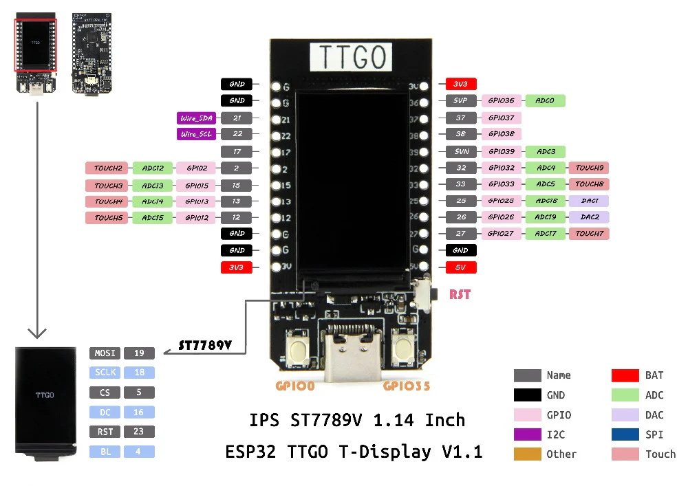

# LilyGO T-Display

This repository shows a "Hello, world!" basic example in Rust for the ESP32-based LilyGO T-Display MCU board.
This board has a revision 3.0 ESP32, WiFi, Bluetooth, and a 1.14" IPS LCD of 135x240 pixels driven by an ST7789V.

More info on the board here:

- [LilyGO official website](https://lilygo.cc/products/lilygo%C2%AE-ttgo-t-display-1-14-inch-lcd-esp32-control-board)
- [GitHub repository](https://github.com/Xinyuan-LilyGO/TTGO-T-Display)

The demo setup for this board initializes the display and clears it to all red pixels.
It took me some time to figure everything out, but got some basic hints from the [project blog of Lily Mara](https://lilymara.xyz/posts/2023/01/images-esp32/).
Much of the code in this blog post is outdated though, which is why I created this project.
Feel free to use it as a basis for your own projects.

## Pins



| Signal Name | Pin Number | Description |
|-------------|------------|-------------|
| TFT_MOSI | 19 | Main out, sub in |
| TFT_SCLK | 18 | Serial clock |
| TFT_CS | 5 | Chip select |
| TFT_DC | 16 | Data command |
| TFT_BL | 4 | Backlight |
| I2C_SDA | 21 | |
| I2C_SCL | 22 | |
| ADC_IN | 34 | |
| BUTTON1 | 35 | |
| BUTTON2 | 0 | |
| RESET | 23 | | |
| ADC Power | 14 | |

## Setting up the workspace

Setup your workspace for building/flashing ESP's as follows:

```
cargo install espup espflash ldproxy
espup install
```

For new projects, install [`cargo-generate`](https://github.com/cargo-generate/cargo-generate) to create a new project like so:

```
cargo generate https://github.com/esp-rs/esp-idf-template cargo
```

## Re-flash original test firmware

To re-flash the demo firmware that came with the board, clone the [LilyGO repository](https://github.com/Xinyuan-LilyGO/TTGO-T-Display) and use `esptool.py` (see [here](https://docs.espressif.com/projects/esptool/en/latest/esp32/)):

`esptool.py -p /dev/ttyACM0 -b 460800 --before default_reset --after hard_reset --chip esp32 write_flash --flash_mode dio --flash_size detect --flash_freq 40m 0x0 TTGO-T-Display/firmware/firmware.bin`
